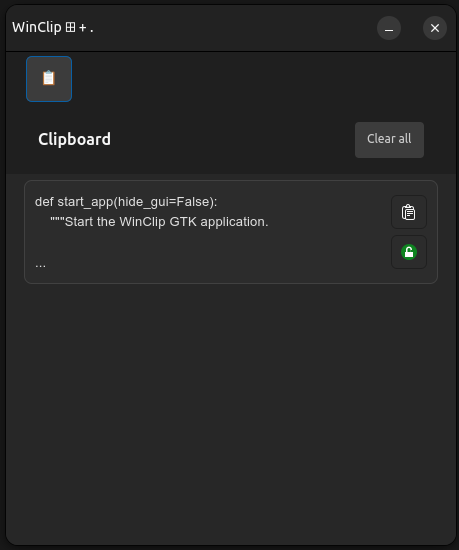

# WinClip

WinClip is a native GTK4 clipboard manager for Linux. It runs as a lightweight background daemon, persisting your clipboard history, and provides a beautiful, fast UI that you can summon instantly via a keyboard shortcut. 



## Features

- **Persistent History:** Clipboard entries are safely stored in a local SQLite database.
- **Pinning:** Pin important clips to keep them at the top of your list.
- **Auto-Paste:** Click any clip to automatically paste it directly into your active window (powered by `ydotool` / `xdotool`).
- **Wayland & X11:** Fully supports both display protocols natively.
- **Background Daemon:** Starts automatically on login via `systemd` and waits silently until summoned.

## Installation

WinClip includes a bulletproof interactive installer that automatically downloads the code, installs the required system dependencies (`gtk4`, `xclip`, `wl-clipboard`, etc.), sets up the Python virtual environment, and configures the background daemon.

Just run this command in your terminal:

```bash
curl -sL https://raw.githubusercontent.com/Allaye/winclip/master/setup_shortcut.sh | bash
```

*Note: The script currently supports Debian/Ubuntu, Fedora, and Arch Linux.*

## Setting Up Your Shortcut

Once installed, WinClip runs invisibly in the background. To summon it, you need to map the "Show" command to a custom keyboard shortcut (like `Ctrl+Alt+C`).

**1. GNOME / KDE:**
- Go to **Settings → Keyboard → Custom Shortcuts**
- Add a new shortcut:
  - **Name:** Show WinClip
  - **Command:** `python3 ~/.local/share/winclip/main.py --show`
  - **Shortcut:** `Ctrl+Alt+C`

**2. i3 / Sway:**
Add this line to your config file:
```text
bindsym $mod+Shift+c exec python3 ~/.local/share/winclip/main.py --show
```

## Manual Usage

If you prefer to run it manually from the terminal:

**Start the daemon in the background:**
```bash
python3 ~/.local/share/winclip/main.py --daemon
```

**Summon the UI:**
```bash
python3 ~/.local/share/winclip/main.py --show
```

**Check daemon status:**
```bash
systemctl --user status winclip.service
```

## License

MIT. See `LICENSE.txt`.
