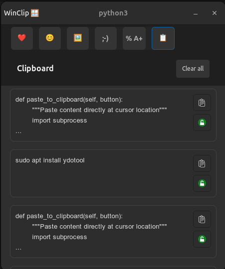

# WinClip

<div align="center">
  <h3 align="center">WinClip - Smart Clipboard Manager</h3>
  <p align="center">
    A lightweight, cross-platform clipboard manager inspired by Windows clipboard manager
    <br />
    <a href="#usage"><strong>View Usage Examples »</strong></a>
    <br />
    <br />
    <a href="https://github.com/Allaye/winclip/issues">Report Bug</a>
    ·
    <a href="https://github.com/Allaye/winclip/issues">Request Feature</a>
  </p>
</div>

<div align="center">
  
  <p><em>WinClip in action - Clean, intuitive interface just like Windows clipboard manager</em></p>
</div>

[![Contributors][contributors-shield]][contributors-url]
[![Forks][forks-shield]][forks-url]
[![Stargazers][stars-shield]][stars-url]
[![Issues][issues-shield]][issues-url]
[![MIT License][license-shield]][license-url]


## Table of Contents

- [About The Project](#about-the-project)
  - [Features](#features)
  - [Built With](#built-with)
- [Getting Started](#getting-started)
  - [Prerequisites](#prerequisites)
  - [Installation](#installation)
- [Usage](#usage)
- [API Reference](#api-reference)
- [Roadmap](#roadmap)
- [Contributing](#contributing)
- [License](#license)
- [Contact](#contact)


## About The Project

WinClip is a lightweight, cross-platform clipboard manager designed to enhance your productivity by keeping track of your clipboard history. Built with Python, it provides a simple yet powerful way to manage and access your copied content.

## Why WinClip?

Coming from Windows and Android, I found that **existing Linux clipboard tools just don't work intuitively**. The shapes, sizes, and user experience feel off - they're either too cluttered, too basic, or just don't feel right.

**Windows clipboard manager (Win + V) and Android's clipboard are the best implementations ever** - they're clean, intuitive, and just work. That's exactly what I'm trying to replicate here.

### What makes WinClip different:

- **🎯 Familiar UX** - Designed to feel like Windows clipboard manager
- **📱 Mobile-inspired** - Clean interface inspired by Android's clipboard
- **⚡ One-click paste** - Click any clip and it automatically pastes (no Ctrl+V needed)
- **📌 Smart pinning** - Pin important clips for quick access
- **🎨 Modern design** - Clean, dark theme that doesn't feel cluttered
- **🔧 Built for Linux** - Native GTK4 integration, works seamlessly with your desktop

### Why existing tools don't cut it:

- **Too complex** - Most Linux clipboard managers are over-engineered
- **Poor UX** - Awkward interfaces that don't feel natural
- **Manual pasting** - Require you to remember Ctrl+V after clicking
- **Outdated design** - Look and feel like they're from 2010
- **Resource heavy** - Bloated with features you don't need

WinClip brings the **Windows/Android clipboard experience to Linux** - simple, fast, and intuitive.

### Features

- ✅ **One-click paste** - Click any clip and it automatically pastes (no Ctrl+V needed!)
- ✅ **Real-time clipboard monitoring** - Captures everything you copy
- ✅ **SQLite database storage** - Persistent clipboard history
- ✅ **Pin/unpin functionality** - Mark important clips for quick access
- ✅ **Modern GTK4 GUI** - Clean, dark interface that feels native
- ✅ **Smart content preview** - See your clips at a glance
- ✅ **Automatic window management** - Minimizes itself when pasting
- ✅ **Cross-platform ready** - Built with Python for easy porting
- 🚧 Search and filter capabilities
- 🚧 Export/import functionality
- 🚧 Keyboard shortcuts

### Built With

- [Python 3.12+](https://python.org/) - Core language
- [SQLite](https://sqlite.org/) - Database storage
- [UV](https://github.com/astral-sh/uv) - Package management


## Getting Started

To get WinClip up and running on your local machine, follow these simple steps.

### Prerequisites

- Python 3.12 or higher
- [UV package manager](https://github.com/astral-sh/uv) (recommended) or pip

Install UV (if you don't have it):

```sh
curl -LsSf https://astral.sh/uv/install.sh | sh
```

### Installation

1. Clone the repository:

   ```sh
   git clone https://github.com/Allaye/winclip.git
   cd winclip
   ```

2. Install dependencies using UV:

   ```sh
   uv sync
   ```

   Or using pip:

   ```sh
   pip install -e .
   ```

3. Run the application:

   ```sh
   python main.py
   ```

The clipboard monitor will start automatically and begin tracking your clipboard activity.


## Usage

### Basic Usage

1. **Start WinClip:**

   ```sh
   python main.py
   ```

2. **Copy any text** - WinClip automatically detects and stores it in the background.

3. **Click the paste button** (📋) on any clip - It automatically pastes wherever your cursor is!

4. **Pin important clips** - Click the lock icon to keep frequently used content at the top.

### How it works

- **Automatic capture** - Everything you copy gets saved automatically
- **One-click paste** - Click any clip and it pastes instantly (no Ctrl+V needed)
- **Smart window management** - WinClip minimizes itself when pasting so it doesn't interfere
- **Persistent storage** - Your clipboard history survives reboots

### Example Workflow

```
1. Copy some text from a website
2. Open WinClip - your text appears in the list
3. Click the paste button (📋) on the clip you want
4. WinClip minimizes and the text appears wherever your cursor is
5. Done! No manual Ctrl+V required
```

### Programmatic Usage

You can also use WinClip's components in your own Python projects:

```python
from winclip.engine.storage import get_recent_clips, init_db
from winclip.engine.model import Clip

# Initialize the database
init_db()

# Get recent clips
clips = get_recent_clips(limit=10)
for clip in clips:
    print(f"{clip.timestamp}: {clip.content[:50]}...")

# Create and store a new clip
new_clip = Clip(content="My custom clip content")
from winclip.engine.storage import insert_clip
insert_clip(new_clip)
```

## API Reference

### Core Classes

#### `Clip`

Represents a clipboard entry with the following attributes:

- `id` (str): Unique identifier
- `content` (str): The clipboard content
- `timestamp` (datetime): When the clip was created
- `pinned` (bool): Whether the clip is pinned
- `source_app` (str, optional): Source application
- `type` (str): Content type (default: "text")
- `tags` (list, optional): Associated tags

### Storage Functions

- `init_db()` - Initialize the SQLite database
- `insert_clip(clip: Clip)` - Store a new clip
- `get_recent_clips(limit=50)` - Retrieve recent clips
- `pin_unpin_clip(clip: Clip)` - Toggle pin status
- `delete_clip(clip_id: str)` - Delete a specific clip
- `clear_clips()` - Clear all clips from database


## Roadmap

- [x] Core clipboard monitoring functionality
- [x] SQLite database storage
- [x] Pin/unpin clips feature
- [x] Modern GTK4 GUI interface
- [x] **One-click automated paste** (the killer feature!)
- [x] Smart window management
- [x] Clean, Windows-inspired design
- [ ] Search and filter functionality
- [ ] Export/import clipboard history
- [ ] Keyboard shortcuts for quick access
- [ ] System tray integration
- [ ] Support for image and file clips
- [ ] Cloud synchronization
- [ ] Plugin system for extensibility
- [ ] Multi-language support
  - [ ] French
  - [ ] Spanish
  - [ ] German

See the [open issues](https://github.com/Allaye/winclip/issues) for a full list of proposed features and known issues.


## Contributing

Contributions are what make the open source community such an amazing place to learn, inspire, and create. Any contributions you make are **greatly appreciated**.

If you have a suggestion that would make this better, please fork the repo and create a pull request. You can also simply open an issue with the tag "enhancement".

1. Fork the Project
2. Create your Feature Branch (`git checkout -b feature/AmazingFeature`)
3. Commit your Changes (`git commit -m 'Add some AmazingFeature'`)
4. Push to the Branch (`git push origin feature/AmazingFeature`)
5. Open a Pull Request

## License

Distributed under the MIT License. See `LICENSE.txt` for more information.

## Contact

Allaye - [@Allaye](https://github.com/Allaye)

Project Link: [https://github.com/Allaye/winclip](https://github.com/Allaye/winclip)


---

## Acknowledgments

Special thanks to the following resources and communities:

- [Python Community](https://python.org/) for the excellent language and ecosystem
- [SQLite](https://sqlite.org/) for the lightweight database solution
- [UV](https://github.com/astral-sh/uv) for modern Python package management
- [GitHub](https://github.com) for hosting and collaboration tools

<!-- MARKDOWN LINKS & IMAGES -->
[contributors-shield]: https://img.shields.io/github/contributors/Allaye/winclip.svg?style=for-the-badge
[contributors-url]: https://github.com/Allaye/winclip/graphs/contributors
[forks-shield]: https://img.shields.io/github/forks/Allaye/winclip.svg?style=for-the-badge
[forks-url]: https://github.com/Allaye/winclip/network/members
[stars-shield]: https://img.shields.io/github/stars/Allaye/winclip.svg?style=for-the-badge
[stars-url]: https://github.com/Allaye/winclip/stargazers
[issues-shield]: https://img.shields.io/github/issues/Allaye/winclip.svg?style=for-the-badge
[issues-url]: https://github.com/Allaye/winclip/issues
[license-shield]: https://img.shields.io/github/license/Allaye/winclip.svg?style=for-the-badge
[license-url]: https://github.com/Allaye/winclip/blob/master/LICENSE.txt
